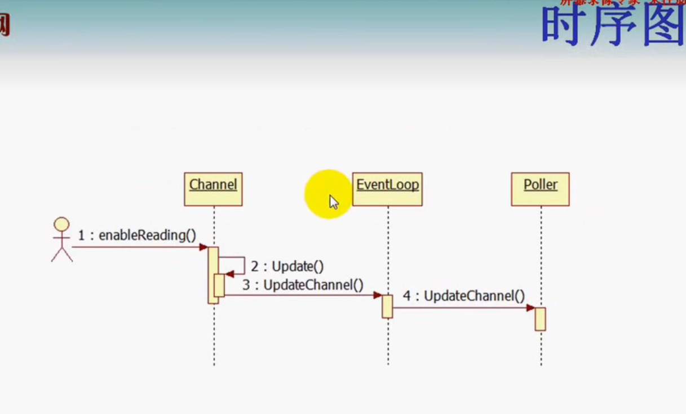

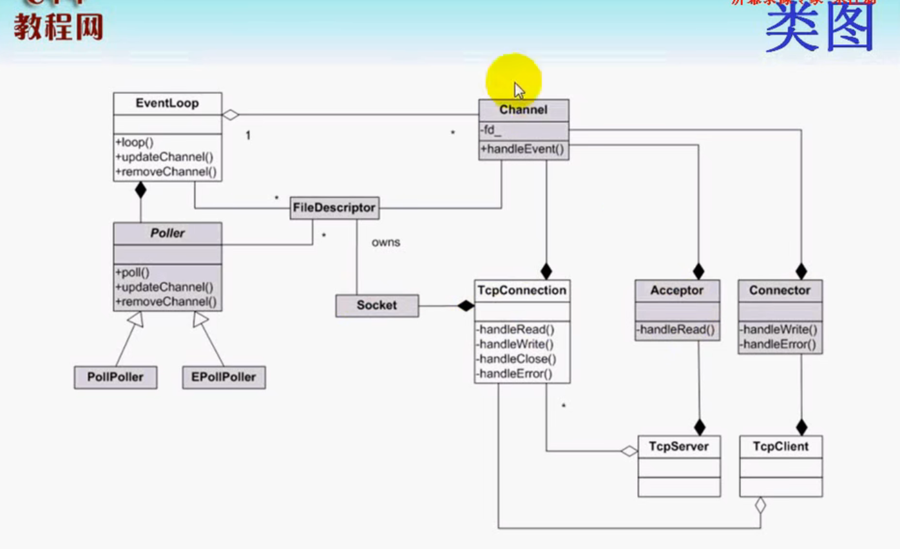

reference:

https://blog.csdn.net/qq_41868108/article/details/105905682

https://blog.csdn.net/yolo_yyh/article/details/118367979

https://www.likecs.com/show-203883515.html?sc=1500

https://blog.csdn.net/weixin_43705457/article/details/104405603


# base 库

## Timestamp.h

### static_assert

### boost::less_than_comparable

只要实现operator<() const 就可自动实现<=,>,>=

less_than_comparable.cpp

### boost::equality_comparable

只要实现operator==() const ,就能自动实现operator !=()const

less_than_comparable.cpp

### gmtime_r


## Atomic.h

C/C++ 中数值操作，如自加 (n++) 自减 (n- -) 及赋值 (n=2) 操作都不是原子操作。

### gcc提供的常用原子性操作

```c++
// 原子自增操作，将value更新到*ptr，并返回操作之前*ptr的值
type __sync_fetch_and_add(type* ptr, type value)
    
// 原子比较和交换(设置)操作
// 比较*ptr与oldval的值，如果两者相等，则将newval更新到*ptr并返回操作之前*ptr的值
type __sync_val_compare_and_swap(type* ptr, type oldval, type newval)
// 比较*ptr与oldval的值，如果两者相等，则将newval更新到*ptr并返回true
bool __sync_bool_compare_and_swap(type* ptr, type oldval, type newval)
    
// 原子赋值操作，将*ptr设置为value,对*ptr加锁, 并返回*ptr操作之前的值.
type __sync_lock_test_and_set(type* ptr, type value) 

// 使用这些原子性操作，编译的时候需要加-march=cpu-type
// cpu-type就是cpu体系结构:(如:native, i386, pentium等) 
```

references: [Gcc内置原子操作__sync_系列函数简述及例程](https://zhuanlan.zhihu.com/p/32303037)

### volatile

[volatile](../../../3github/ElegantTest/test_cpp/keyword/volatile/volatile.md)


## Exception.h

### backtrace

栈回溯，保存各个栈帧的地址

### backtrace_symbols

根据地址，转成相应的函数符号。

backtrace_symbols 内部会调用malloc, 返回的指针需要由调用者释放。

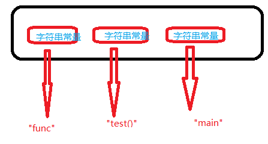

### abi::__cxa_demangle

把函数符号转换成函数名

## Logging.h

### Logger类

Logger类时序图:

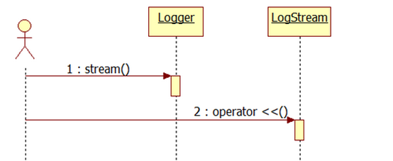

首先创建一个Logger对象，然后调用stream()方法，返回一个LogStream的对象，再调用LogStream的重载运算符operator <<()输出日志，这是比较宏观的。
		实际上的实现会更加细一点，在Logger类的内部有嵌套Impl类来负责实际的实现， Logger类就是负责一些日志的级别，是外层的一个日志类；而Impl类是借助LogStream类来输出日志的，LogStream对象重载<<运算符来输出日志。
		事实上，日志类是先输出到缓冲区**FixedBuffer**，然后再输出到标准输出或文件， 通过g_output函数来指定输出到哪里，借助g_flush函数刷新。因为g_output也是只能输出到指定设备/文件 的缓冲区，g_flush函数刷新一下才能真正到指定位置。


### Impl类

类内私有类

### SourceFile类

类内共有类


# muduo线程模型

## 1.单线程Reactor

单线程reactor----->监听套接字，连接套接字，业务处理都在reactor线程处理

计算和IO在同一个线程，没有事件的时候，线程等待在select/poll/epoll等函数上，事件到达后由网络库处理IO，再把消息通知客户端代码，网络库负责读写Socket，用户代码负责解码、计算、编码。事件顺序处理，无法保证优先级。这种模式适用于IO密集的应用，不太适合CPU密集的应用；

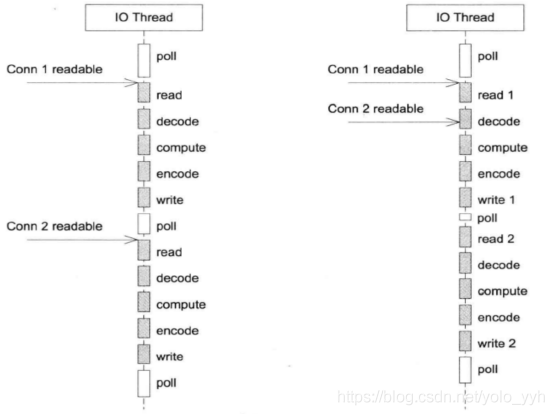

实际项目应用中，这种模型应该并不常用。

代码目录：muduo/examples/sudoku/server_basic.cc

Server_basic.cc是一个并发服务器，可以同时服务多个客户端连接，但是是单线程的。

其中最关键的是onMessage()函数，主要用来从缓冲区读取数据，并调用processRequest()去处理请求，其中全部的IO和计算任务都在同一个线程中进行。

## 2.Reactor+线程池

单线程reactor + threadpool ----> 监听套接字，连接套接字都在reactor线程处理，业务计算放到线程池。

主线程负责IO，工作线程负责计算，使用固定大小的线程池，$\color{red} {全部的IO工作都在一个Reactor线程完成，}$ $\color{green} {而计算任务交给线程池}$，这种模式适用于计算任务彼此独立，而且IO压力不大的场景，有乱序返回的可能，客户端要根据id来匹配响应。

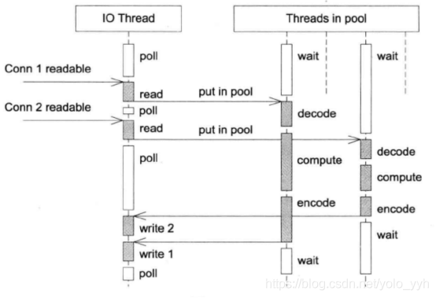

代码目录：muduo/examples/sudoku/server_threadpool.cc

与方案1的区别是多了ThreadPool对象，线程池大小由numThreads_指定，然后processRequest()中计算的部分由ThreadPool去执行。这种方案有乱序返回的可能，所以要根据id来匹配响应。

## 3.multiReactors

multiReactors -----> one loop per thread (一个主reactor线程(accept线程), 其他连接套接字的读写和业务计算在其他reactor线程中运行)。

一个main Reactor负责accept连接，然后把连接挂在某个sub Reactor（$\color{red} {muduo采用轮询方式选择sub Reactor}$）中，$\color{green} {该连接的所有操作都在那个sub Reactor所处的线程中完成。}$优点是能保证请求的顺序性，程序的总体处理能力不会随着连接增加而下降，适应性强，所以是muduo的默认多线程模型。

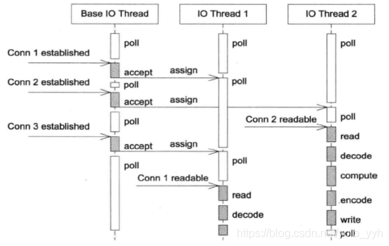

代码目录：muduo/examples/sudoku/server_multiloop.cc

这种模式下只需要设置server_.setThreadNum(numThreads_)即可。TcpServer在这种模式下用自己的EventLoop接受新连接，然后用event loop pool里的EventLoop去执行IO；
------------------------------------------------
版权声明：本文为CSDN博主「yolo_yyh」的原创文章，遵循CC 4.0 BY-SA版权协议，转载请附上原文出处链接及本声明。
原文链接：https://blog.csdn.net/yolo_yyh/article/details/118367979

## 4.multiReactors + 线程池

multiReactors + threadPool ----> one loop per thread +  thread pool (线程池共享，一个主reactor线程(accept线程), 其他连接套接字的读写在每个子reactor线程中运行，每个reactor的业务计算在线程池中运行)

既有多个Reactor来处理IO，也使用线程池来处理计算，这种模式适合既有突发IO，又有突发计算的应用。

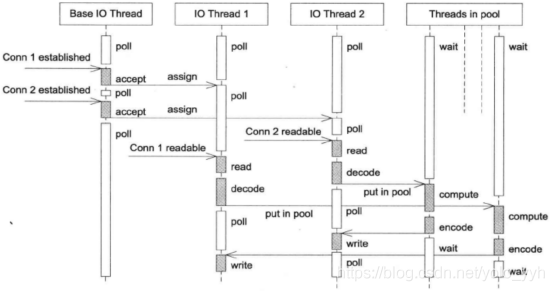

如何确定使用多少个EventLoop呢？

根据ZeroMQ手册的建议，按照每千兆比特每秒的吞吐量配一个event loop的比例来设置event loop的数目（即muduo::TcpServer::setThreadNum()的数量），所以在编写运行于千兆以太网上的网络程序时，用一个event loop就足以应付网络IO。如果TCP连接有优先级之分，那使用一个event loop不太合适，最好是把高优先级的连接用单独的event loop来处理。
------------------------------------------------


# Muduo是什么？

[muduo](https://github.com/chenshuo/muduo)是[陈硕](http://chenshuo.com/)大神个人开发的C++的TCP网络编程库。muduo基于Reactor模式实现。Reactor模式也是目前大多数Linux端高性能网络编程框架和网络应用所选择的主要[架构](https://so.csdn.net/so/search?q=架构&spm=1001.2101.3001.7020)，例如内存数据库[Redis](https://cloud.tencent.com/product/crs?from=10680)和Java的Netty库等。

陈硕的《Linux多线程服务器端编程》一书对muduo整个架构进行了非常详尽的介绍和分析，可以说是学习muduo源码和设计理念最好的资料了。这本书也非常推荐大家购买阅读，感觉是后台开发的必读书目了。

而本文则主要是从源码角度辅助理解整个muduo的实现，同时也姑且算是对muduo的一个小小的补充。

同时提供了一个[muduo注释版](https://github.com/chenyahui/AnnotatedCode/tree/master/muduo)，以辅助大家参考学习。

# muduo的架构和概念

muduo中类的职责和概念划分的非常清晰，在《Linux多线程服务器端编程》一书的6.3.1章节有详细的介绍。实际上目前很多网络库的接口设计也都受到了muduo的影响，例如360的evpp等。

### 经典的服务器设计模式Reactor模式

大多数人学习Linux网络编程的起点可能都是从《UNP》开始的，书中描述的服务端程序架构基本上是一个大的while循环，程序阻塞在accept或poll函数上，等待被监控的socket描述符上出现预期的事件。事件到达后，accept或poll函数的阻塞解除，程序向下执行，根据socket描述符上出现的事件，执行read、write或错误处理。 
整体架构如下图所示： 

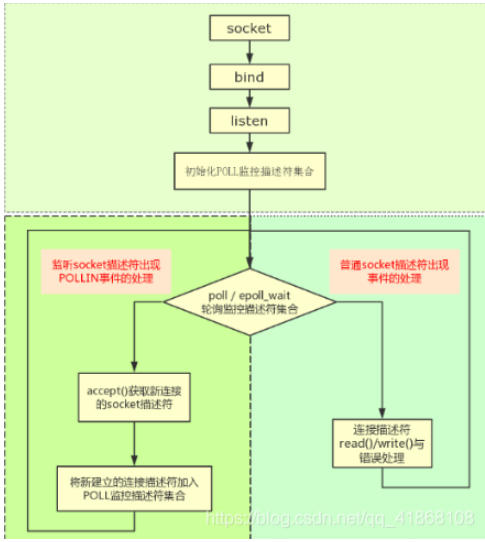

而muduo的整体风格受到netty的影响，整个架构依照Reactor模式，基本与如下图所示相符：

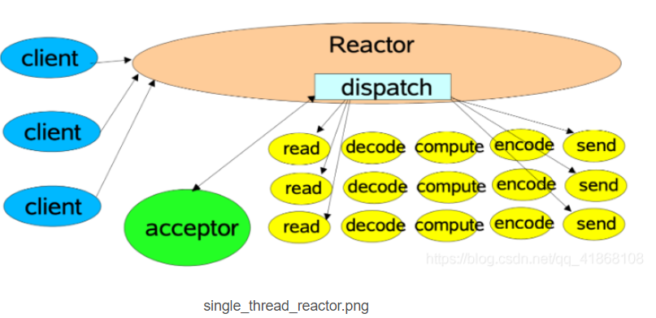


所谓Reactor模式，是有一个循环的过程，监听对应事件是否触发，触发时调用对应的callback进行处理。

这里的事件在muduo中包括Socket$\color{red} {可读写事件、定时器事件。}$在其他网络库中如libevent也包括了signal、用户自定义事件等。

负责事件循环的部分在muduo命名为`EventLoop`，其他库如netty、libevent也都有对应的组件。

负责监听事件是否触发的部分，在muduo中叫做`Poller`。muduo提供了epoll和poll两种来实现，默认是epoll实现。

通过环境变量`MUDUO_USE_POLL`来决定是否使用poll:

```
Poller *Poller::newDefaultPoller(EventLoop *loop)
{
  if (::getenv("MUDUO_USE_POLL"))
  {
    return new PollPoller(loop);
  }
  else
  {
    return new EPollPoller(loop);
  }
}
```

此外，图中的acceptor负责accept新连接，并将新连接分发到subReactor。这个组件在muduo中也叫做`Acceptor`。

关于图中的其他部分，会在muduo的线程模型一节有详细介绍。

# 一个简单的例子

本文首先从最简单的echo server入手，来介绍muduo的基本使用，同时也方便后面概念的理解。

```
void onMessage(const muduo::net::TcpConnectionPtr& conn,
                           muduo::net::Buffer* buf,
                           muduo::Timestamp time)
{
  conn->send(buf);
}

int main()
{
    muduo::net::EventLoop loop;//建立一个事件循环器EventLoop
    muduo::net::InetAddress listenAddr(2007);
    TcpServer server(&loop, listenAddr);//建立对应的业务服务器TcpServer
    server.setMessageCallback(onMessage);//设置TcpServer的Callback
    server.start();//启动server
    loop.loop();//开启事件循环
}
```

echo-server的代码量非常简洁。一个典型的muduo的TcpServer工作流程如下：

```
1.建立一个事件循环器EventLoop
2.建立对应的业务服务器TcpServer
3.设置TcpServer的Callback
4.启动server
5.开启事件循环
```

# 三个半事件

 **<u>==陈硕认为，TCP网络编程的本质是处理三个半事件==</u>**，即：

- 连接的建立
- 连接的断开：包括主动断开和被动断开
- 消息到达，文件描述符可读。
- 消息发送完毕。这个算半个事件。

## 1.连接的建立

在我们单纯使用linux的API，编写一个简单的Tcp服务器时，建立一个新的连接通常需要四步：
```
步骤1. socket() // 调用socket函数建立监听socket

步骤2. bind() // 绑定地址和端口

步骤3. listen() // 开始监听端口

步骤4. accept() // 返回新建立连接的fd
```
我们接下来分析下，这四个步骤在muduo中都是何时进行的：

首先在TcpServer对象构建时，TcpServer的属性acceptor同时也被建立。
在Acceptor的构造函数中分别调用了socket函数和bind函数完成了步骤1和步骤2。
即，当TcpServer server(&loop, listenAddr);$\color{red} {执行结束时，监听socket已经建立好，并已绑定到对应地址和端口了。}$
而当执行$\color{red} {server.start()}$时，主要做了两个工作：
    **1.在监听socket上启动listen函数，也就是步骤3；**
    **2.将监听socket的可读事件注册到EventLoop中。**
示意图如下:
    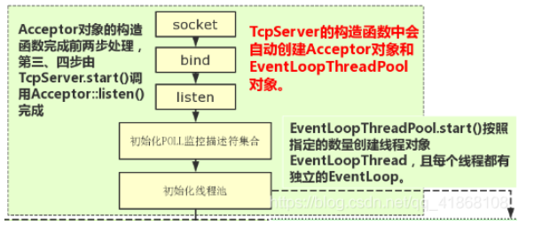


此时，程序已完成对地址的监听，但还不够，因为此时程序的主角EventLoop尚未启动。

当调用$\color{red} {loop.loop()}$时，程序开始监听该socket的可读事件。

当新连接请求建立时，可读事件触发，此时该事件对应的callback在EventLoop::loop()中被调用。

该事件的callback实际上就是$\color{red} {Acceptor::handleRead()}$方法。

在Acceptor::handleRead()方法中，做了三件事：
```
    1.调用了accept函数，完成了步骤4，实现了连接的建立。得到一个已连接socket的fd
    2.创建TcpConnection对象
    3.将已连接socket的可读事件注册到EventLoop中。
```

这里还有一个需要注意的点，创建的TcpConnnection对象是个shared_ptr，该对象会被保存在TcpServer的connections中。$\color{red} {这样才能保证引用计数大于0，对象不被释放。}$

至此，一个新的连接已完全建立好，其可读事件也已注册到EventLoop中了。

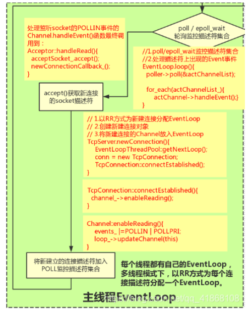

## 2.消息的读取

上节讲到，在新连接建立的时候，会将新连接的socket的可读事件注册到EventLoop中。

假如客户端发送消息，导致已连接socket的可读事件触发，该事件对应的callback同样也会在EventLoop::loop()中被调用。

该事件的callback实际上就是TcpConnection::handleRead方法。

在$\color{red} {TcpConnection::handleRead}$方法中，主要做了两件事：

```
1.从socket中读取数据，并将其放入inputbuffer中
2.调用messageCallback，执行业务逻辑。
```

```
  ssize_t n = inputBuffer_.readFd(channel_->fd(), &savedErrno);
  if (n > 0)
  {
    messageCallback_(shared_from_this(), &inputBuffer_, receiveTime);
  }
```

messageCallback是在建立新连接时，将`TcpServer::messageCallback`方法bind到了`TcpConnection::messageCallback`的方法。

TcpServer::messageCallback就是业务逻辑的主要实现函数。通常情况下，我们可以在里面实现消息的编解码、消息的分发等工作，这里就不再深入探讨了。

在我们上面给出的示例代码中，echo-server的messageCallback非常简单，就是直接将得到的数据，重新send回去。在实际的业务处理中，一般都会调用TcpConnection::send()方法，给客户端回复消息。

这里需要注意的是，在messageCallback中，用户会有可能会把任务抛给自定义的Worker线程池处理。

$\color{red} {但是这个在Worker线程池中任务，切忌直接对Buffer的操作。因为Buffer并不是线程安全的。}$

我们需要记住一个准则:

> $\color{red} {所有对IO和buffer的读写，都应该在IO线程中完成。}$

<u>一般情况下，先在交给Worker线程池之前，应该现在IO线程中把Buffer进行切分解包等动作。将解包后的消息交由线程池处理，避免多个线程操作同一个资源。</u>

## 3.消息的发送

用户通过调用TcpConnection::send()向客户端回复消息。由于muduo中使用了OutputBuffer，因此消息的发送过程比较复杂。

首先需要注意的是线程安全问题, $\color{red} {对于消息的读写必须都在EventLoop的同一个线程(通常称为IO线程)}$中进行：

因此，$\color{red} {TcpConnection::send保证了线程安全性}$，它是这么做的：

```
void TcpConnection::send(const StringPiece& message)
{
  if (state_ == kConnected)
  {
    if (loop_->isInLoopThread())
    {
      sendInLoop(message);
    }
    else
    {
      void (TcpConnection::*fp)(const StringPiece& message) = &TcpConnection::sendInLoop;
      loop_->runInLoop(
          std::bind(fp,
                    this,     // FIXME
                    message.as_string()));
                    //std::forward<string>(message)));
    }
  }
}
```

检测send的时候，是否在当前IO线程，如果是的话，直接进行写相关操作`sendInLoop`。

如果不在一个线程的话，需要将该任务抛给IO线程执行`runInloop`, 以保证write动作是在IO线程中执行的。我们后面会讲解`runInloop`的具体实现。

在sendInloop中，做了下面几件事：

```
1.假如OutputBuffer为空，则直接向socket写数据
2.如果向socket写数据没有写完，则统计剩余的字节个数，并进行下一步。没有写完可能是因为此时socket的TCP缓冲区已满了。
3.如果此时OutputBuffer中的旧数据的个数和未写完字节个数之和大于highWaterMark，则将highWaterMarkCallback放入待执行队列中
4.将对应socket的可写事件注册到EventLoop中
```

注意，**$\color{red} {直到发送的时候，才把socket的可写事件注册到了EventLoop中。之前只注册了可读事件。}$**

连接socket的可写事件对应的callback是TcpConnection::handleWrite()

当某个socket的可写事件触发时，$\color{red} {TcpConnection::handleWrite}$会做两个工作：

```
1.尽可能将数据从OutputBuffer中向socket中write数据
2.如果OutputBuffer没有剩余的，则将该socket的可写事件移除，并调用writeCompleteCallback
```

#### 为什么要移除可写事件

因为当OutputBuffer中没数据时，我们不需要向socket中写入数据。但是此时socket一直是处于可写状态的， 这将会导致TcpConnection::handleWrite()一直被触发。然而这个触发毫无意义，因为并没有什么可以写的。

所以muduo的处理方式是，当OutputBuffer还有数据时，socket可写事件是注册状态。当OutputBuffer为空时，则将socket的可写事件移除。

此外，$\color{red} {highWaterMarkCallback和writeCompleteCallback一般配合使用，起到限流的作用。}$在《linux多线程服务器端编程》一书的8.9.3一节中有详细讲解。这里就不再赘述了

## 4.连接的断开

我们看下muduo对于连接的断开是怎么处理的。

连接的断开分为被动断开和主动断开。主动断开和被动断开的处理方式基本一致，因此本文只讲下被动断开的部分。

被动断开即远程端断开了连接，server端需要感知到这个断开的过程，然后进行的相关的处理。

其中感知远程断开这一步是在Tcp连接的可读事件处理函数`handleRead`中进行的：$\color{red} {当对socket进行read操作时，返回值为0，}$则说明此时连接已断开。

接下来会做四件事情：

```
1.将该TCP连接对应的事件从EventLoop移除
2.调用用户的ConnectionCallback
3.将对应的TcpConnection对象从Server移除。
4.close对应的fd。此步骤是在析构函数中被动触发的，当TcpConnection对象被移除后，引用计数为0，对象析构时会
```

# runInLoop的实现

在讲解消息的发送过程时候，我们讲到为了保证对buffer和socket的写动作是在io线程中进行，使用了一个`runInLoop`函数，将该写任务抛给了io线程处理。

我们接下来看下`runInLoop`的实现：

```
void EventLoop::runInLoop(Functor cb)
{
  if (isInLoopThread())
  {
    // 如果是当前IO线程调用runLoop, 则同步调用cb
    cb();
  }
  else
  {
    // 如果是其他线程调用runLoop, 则异步地将cb添加到队列
    queueInLoop(std::move(cb));
  }
}
```

这里可以看到，做了一层判断。如果调用时是此EventLoop的运行线程，则直接执行此函数。

否则调用`queueInLoop`函数。我们看下`queueInLoop`的实现。

```
void EventLoop::queueInLoop(Functor cb)
{
  {
    MutexLockGuard lock(mutex_);
    pendingFunctors_.push_back(std::move(cb));  //添加到任务队列
  }

  // 调用queueInLoop的线程不是当前IO线程(eventloop那个线程)需要唤醒
  // 或者调用queueInLoop的线程是当前IO线程，并且此时正在调用pendingfunctor, 需要唤醒
  // 只有当前IO线程的事件回调中调用queueInLoop才不需要唤醒
  if (!isInLoopThread() || callingPendingFunctors_)
  {
    wakeup();
  }
}
```

这里有两个动作：

```
1.加锁，然后将该函数放到该EventLoop的pendingFunctors_队列中。
2.判断是否要唤醒EventLoop，如果是则调用wakeup()唤醒该EventLoop。
```

这里有几个问题：

- 为什么要唤醒EventLoop？
- wakeup是怎么实现的?
- pendingFunctors_是如何被消费的?

#### 为什么要唤醒EventLoop

我们首先调用了`pendingFunctors_.push_back(cb);`, 将该函数放在pendingFunctors_中。$\color{red} {EventLoop的每一轮循环最后会调用doPendingFunctors依次执行这些函数。}$

而EventLoop的唤醒是通过epoll_wait实现的，如果此时该EventLoop中迟迟没有事件触发，那么epoll_wait一直就会阻塞。

这样会导致，pendingFunctors_迟迟不能被执行了。

所以对EventLoop的唤醒是必要的。

#### wakeup是怎么实现的

muduo这里采用了对eventfd的读写来实现对EventLoop的唤醒。

在EventLoop建立之后，就创建一个eventfd，并将其可读事件注册到EventLoop中。

`wakeup()`的过程本质上是对这个eventfd进行写操作，以触发该eventfd的可读事件。这样就起到了唤醒EventLoop的作用。

```
void EventLoop::wakeup()
{
  uint64_t one = 1;
  ssize_t n = sockets::write(wakeupFd_, &one, sizeof one);
  if (n != sizeof one)
  {
    LOG_ERROR << "EventLoop::wakeup() writes " << n << " bytes instead of 8";
  }
}
```

$\color{red} {很多库为了兼容macos，往往使用pipe来实现这个功能。}$muduo采用了eventfd，性能更好些，但代价是不能支持macos了。不过muduo似乎从一开始的定位就不打算支持？

#### doPendingFunctors的实现

本部分讲下`doPendingFunctors`的实现，muduo是如何处理这些待处理的函数的，以及中间用了哪些优化操作。

代码如下所示

```
void EventLoop::doPendingFunctors()
{
  std::vector<Functor> functors;
  callingPendingFunctors_ = true;

  {
    MutexLockGuard lock(mutex_);
    functors.swap(pendingFunctors_);
  }

  for (const Functor &functor : functors)
  {
    functor();
  }
  callingPendingFunctors_ = false;
}
```

从代码可以看到，函数非常简单。大概只有十行代码，但是这十行却有两个非常巧妙的措施。

**callingPendingFunctors_的作用**

从代码可以看出，如果callingPendingFunctors_为false，则说明此时尚未开始执行doPendingFunctors函数。

这个有什么作用呢，我们需要结合下queueInLoop中，对是否执行wakeup()的判断

```
 if (!isInLoopThread() || callingPendingFunctors_)
  {
    wakeup();
  }
```

这里还需要结合下EventLoop循环的实现，其中`doPendingFunctors()`是**每轮循环的最后一步处理**。

如果调用queueInLoop和EventLoop在同一个线程，且callingPendingFunctors_为false时，则说明：**此时尚未执行到doPendingFunctors()。**

$\color{red} {那么此时即使不用wakeup，也可以在之后照旧执行doPendingFunctors()了。}$

这么做的好处非常明显，可以减少对eventfd的io读写。

**锁范围的减少**

在此函数中，有一段特别的代码：

```
  std::vector<Functor> functors;
  
  {
    MutexLockGuard lock(mutex_);
    functors.swap(pendingFunctors_);
  }
```

这个作用是pendingFunctors*和functors的内容进行交换，实际上就是此时functors持有了pendingFunctors*的内容，而pendingFunctors_被清空了。

这个好处是什么呢？

如果不这么做，直接遍历pendingFunctors_,然后处理对应的函数。这样的话，锁会一直等到所有函数处理完才会被释放。在此期间，queueInLoop将不可用。

而以上的写法，可以极大减小锁范围，整个锁的持有时间就是swap那一下的时间。待处理函数执行的时候，$\color{red} {其他线程}$还是可以继续调用queueInLoop。

# muduo的线程模型

muduo默认是单线程模型的，即只有一个线程，里面对应一个EventLoop。这样整体对于线程安全的考虑可能就比较简单了，

但是muduo也可以支持以下几种线程模型：

## 主从reactor模式
主从reactor是netty的默认模型，一个reactor对应一个EventLoop。主Reactor只有一个，只负责监听新的连接，accept后将这个连接分配到子Reactor上。子Reactor可以有多个。这样可以分摊一个Eventloop的压力，性能方面可能会更好。如下图所示：

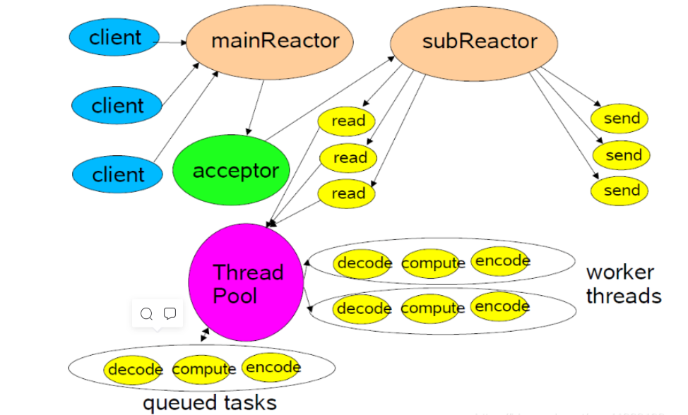

在muduo中也可以支持主从Reactor，$\color{red} {其中主Reactor的EventLoop就是TcpServer的构造函数中的}$`EventLoop*`参数。Acceptor会在此EventLoop中运行。

而子Reactor可以通过TcpServer::setThreadNum(int)来设置其个数。因为一个Eventloop只能在一个线程中运行，所以线程的个数就是子Reactor的个数。

如果设置了子Reactor，新的连接会通过Round Robin的方式分配给其中一个EventLoop来管理。<u>如果没有设置子Reactor，则是默认的单线程模型，新的连接会再由主Reactor进行管理。</u>

但其实这里似乎有些不合适的地方：多个TcpServer之间可以共享同一个主EventLoop，但是子Eventloop线程池却不能共享，这个是每个TcpServer独有的。

这里不太清楚是muduo的设计问题，还是作者有意为之。不过netty的主EventLoop和子Eventloop池都是可以共享的。
## 业务线程池

对于一些阻塞型或者耗时型的任务，例如SQL操作等。这些显然是不能放在IO线程（即EventLoop所在的线程）中运行的，因为会严重影响EventLoop的正常运行。

对于这类耗时型的任务，一般做法是可以放在另外单独线程池中运行，这样就不会阻塞IO线程的运行了。我们一般把这种处理耗时任务的线程叫做Worker线程。

muduo本身没有提供一套直接使用Worker线程池的方式，但是muduo本身提供了线程池的相关类`ThreadPool`。

$\color{red} {muduo官方的推荐做法是，在OnMessage中，自行进行包的切分，然后将数据和对应的处理函数打包成Task的方式提交给线程池。}$

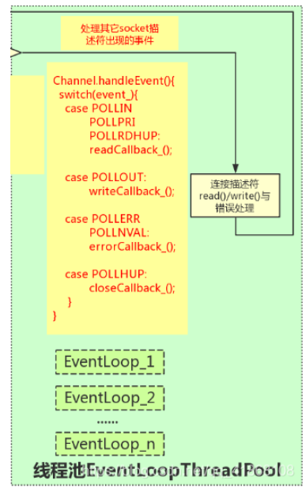

----------------------------------------------------------------